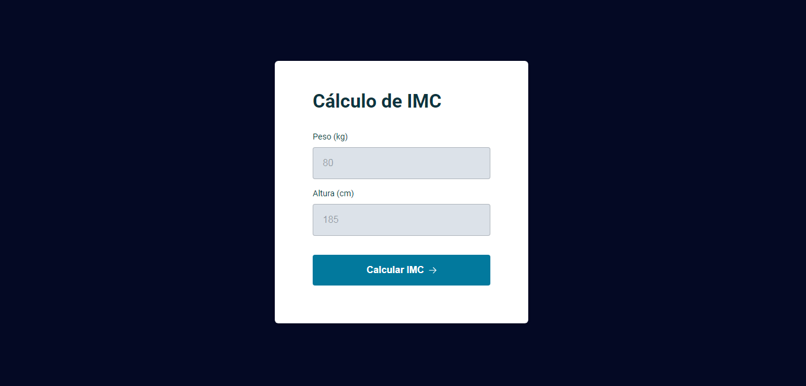

<h1 align="center"> BMI Calculator </h1>

> [Technologies](#technologies)

> [Project](#project)

> [How to Use](#how-to-use)

> [Files](#files)

> [License](#license)

> [README in Portuguese](#readme-in-portuguese)

  

 

  

## Technologies

- HTML
- CSS
- JavaScript
- Git and GitHub
- Figma

## Project

This is a project that calculates the body mass index (BMI) based on weight and height entered by the user in a form.

The project uses JavaScript modules to organize the code into separate files and import them as needed. In addition, the project logic also includes the display of a popup that shows a message with the calculated BMI result.

## How to Use

To access the finished project, [click here](https://fernandoalvesrufino.github.io/calculadora-imc/).

Fill in the form with your weight and height (in centimeters) and click Calculate BMI. The result of your BMI will be displayed in a popup.

## Files

The project is composed of the following files:

- `index.html` - contains the basic HTML markup for the form and modal.
- `style.css` - project styling file.
- `modal.js` - defines the Modal class to control the opening and closing of the message modal.
- `alert-error.js` - defines the AlertError class to display an error alert when the user does not correctly fill in the form fields.
- `utils.js` - contains utility functions to validate if a value is a number and calculate the BMI based on the weight and height entered by the user.
- `script.js` - contains the main project logic, such as DOM manipulation and function calls to calculate the BMI and display the result in a modal.

## License
This project is under the MIT license.

---

by Fernando Rufino

> Project created by Rocketseat

# README in portuguese

<h1 align="center"> Calculadora de IMC </h1>

> [Tecnologias](#tecnologias)

> [Projeto](#projeto)

> [Como Usar](#como-usar)

> [Arquivos](#arquivos)

> [Licença](#licença)

  

 

  

## Tecnologias

- HTML
- CSS
- JavaScript
- Git e GitHub
- Figma

## Projeto

Este é um projeto que calcula o índice de massa corporal (IMC) com base no peso e altura inseridos pelo usuário em um formulário.

O projeto utiliza módulos JavaScript para organizar o código em arquivos separados e importá-los conforme necessário. Além disso, a lógica do projeto também inclui a exibição de um popup que exibe uma mensagem com o resultado do IMC calculado.

## Como Usar

- Para acessar ao projeto finalizado, [clique aqui](https://fernandoalvesrufino.github.io/calculadora-imc/).

Preencha o formulário com seu peso e altura (em centímetros) e clique em `Calcular IMC`. O resultado do seu IMC será exibido em um popup.

## Arquivos

O projeto é composto pelos seguintes arquivos:

- `index.html` - contém a marcação HTML básica para o formulário e modal.
- `style.css` - arquivo de estilização do projeto.
- `modal.js` - define a classe Modal para controlar a abertura e fechamento do modal de mensagem.
- `alert-error.js` - define a classe AlertError para exibir um alerta de erro quando o usuário não preencher corretamente os campos do formulário.
- `utils.js` - contém funções utilitárias para validar se um valor é um número e calcular o IMC com base no peso e altura inseridos pelo usuário.
- `script.js` - contém a lógica principal do projeto, como manipulação do DOM e chamadas de função para calcular o IMC e exibir o resultado em um modal.

## Licença

Esse projeto está sob a licença MIT.

---

by Fernando Rufino

> Projeto criado pela Rocketseat 